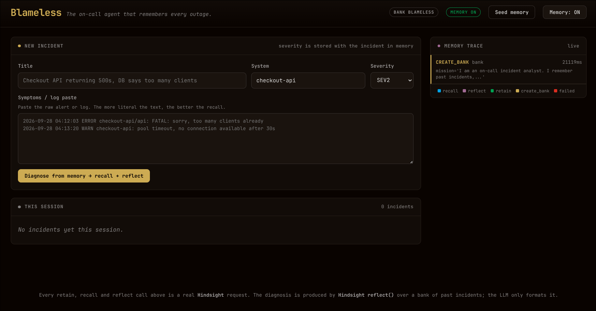
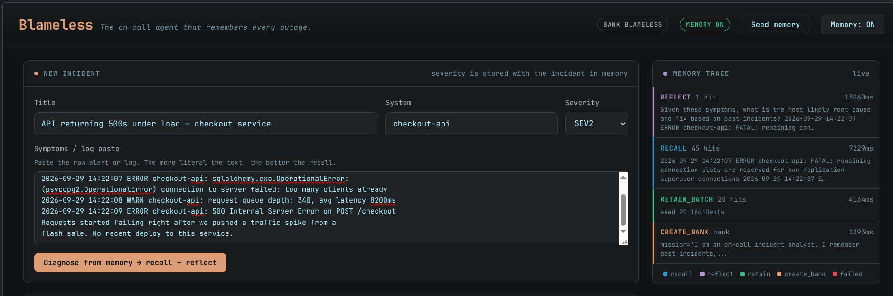
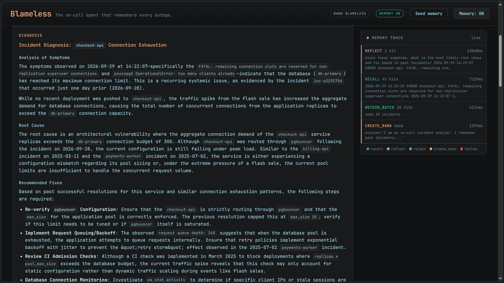
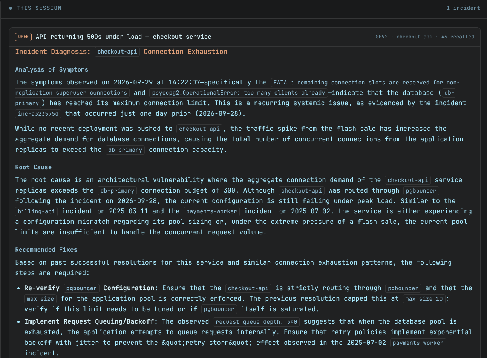

# Blameless

**The on-call agent that remembers every outage.**

Blameless is an incident-diagnosis agent for DevOps and security teams. When a new
incident arrives, it searches a memory bank of every incident the organisation has
already resolved (symptoms, root cause, fix) and diagnoses the new one from that
history in seconds. Every resolved incident is written back into memory, so the
system gets better the longer it runs.

Persistent memory is powered by [Hindsight](https://hindsight.vectorize.io/).

The important design decision: **the LLM does not diagnose.** Hindsight's
`reflect()` reasons over the memory bank and produces the diagnosis. The language
model only formats that answer for humans. Remove the memory and the quality
visibly collapses, which is the point.



---

## Contents

- [Screenshots](#screenshots)
- [What it does](#what-it-does)
- [How Hindsight is used](#how-hindsight-is-used)
- [Running the project](#running-the-project)
- [Project layout](#project-layout)
- [API reference](#api-reference)
- [The seed incident library](#the-seed-incident-library)
- [Demo walkthrough](#demo-walkthrough)
- [Troubleshooting](#troubleshooting)

---

## Screenshots

**1. A new incident arrives.** Title, system, severity and the raw log paste from
the on-call engineer. Nothing else the agent decides what is relevant.



**2. The diagnosis.** Produced by Hindsight `reflect()` over the bank. The
"Recalled from memory" panel names the past incidents consulted, with relevance
scores, and the diagnosis cites them by ID.


**3. Mark resolved.** Write a blameless root cause and fix, then press **Retain
into memory**. This `retain` call is what closes the learning loop.



**4. This session.** Incidents raised in this session, with their diagnosis, root
cause and resolution, and how many memories each one recalled.



**5. End of session.** The summary of what the bank learned during the run.


---

## What it does

Three steps, in a loop:

1. **Recall**: when an incident arrives, semantically search the memory bank for
   past incidents with similar symptoms.
2. **Reflect**: ask Hindsight to reason over those memories and produce the most
   likely root cause and fix. This is the diagnosis.
3. **Retain**: once the incident is resolved, write the postmortem back into the
   bank so the *next* similar incident can use it.

That third step is what makes it an agent rather than a search box. The loop:

```
POST /incidents                      POST /incidents/{id}/resolve
       │                                       │
  recall() ── 45 past memories          retain() ── postmortem
       │                                       │
  reflect() ── diagnosis                       │
       │                                       │
  LLM formats ──► UI                           │
                                               └──► the next similar
                                                     incident recalls this one
```

Incident root causes are written blamelessly: they describe systems, configuration
and process, never a person. *"The connection-pool ceiling was never tied to the
database's max_connections budget"*, not *"the engineer forgot to size the pool"*.

---

## How Hindsight is used

All four Hindsight calls live in a single file, [`memory.py`](memory.py). Nothing
else in the project imports `hindsight_client`. That file is commented in detail:
it is the one to read when you want to understand or explain the memory layer.

Hindsight organises memory into **banks**. Blameless uses one bank (default
`blameless`) as its long-term incident memory.

### 1. `create_bank()`: define the agent, at startup

```python
await client.acreate_bank(
    bank_id="blameless",
    name="Blameless",
    mission="I am an on-call incident analyst. I remember past incidents, their "
            "root causes and fixes, and use them to diagnose new ones. I focus "
            "on systemic causes, never on blaming people.",
    disposition={"skepticism": 4, "literalism": 3, "empathy": 2},
)
```

The **mission** is a standing instruction Hindsight holds on every retain and
reflect. Here it is what keeps the analysis blameless and incident-focused.

The **disposition** sets its character:

| Setting | Value | Why |
|---|---|---|
| `skepticism` | 4 | An incident report is evidence, not a vibe. High skepticism keeps conclusions tied to what actually happened. |
| `literalism` | 3 | Interpret log text and symptoms as written, without over-reading intent. |
| `empathy` | 2 | Deliberately low. This is an on-call analyst, not a support agent. |

This call is **idempotent**: if the bank already exists Hindsight returns a 409 and
we ignore it. Memory is meant to outlive the process, so a restart reattaches to
the existing bank rather than recreating it.

### 2. `retain()`: write the lesson down (the learning loop)

Called when an incident is marked resolved:

```python
await client.aretain(
    bank_id="blameless",
    content=incident_to_memory_text(incident),   # symptoms + root cause + resolution
    context="incident report",
    timestamp=incident["timestamp"],
    document_id=incident["id"],
    metadata={"severity": "SEV1", "system": "checkout-api"},
)
```

- `content` is the full postmortem as plain text with a consistent
  `SYMPTOMS / ROOT CAUSE / RESOLUTION` layout. Consistent structure matters,
  because Hindsight chunks and embeds this text, so a predictable layout retrieves
  better than free-form prose.
- `document_id` is the incident ID, so a retained incident is traceable back to
  the UI card that produced it. You will see these IDs in the "Recalled from
  memory" panel.
- `metadata` carries structured fields (`severity`, `system`) that retrieval can
  filter on.
- `timestamp` places the memory on Hindsight's timeline, which is what makes
  "what broke last quarter?" answerable.

### 3. `retain_batch()`: the same thing, many at once

`POST /seed` uses this to load the 20-incident library in **one** request instead
of 20 serial ones (~15s instead of minutes).

### 4. `recall()`: find the precedent

```python
await client.arecall(
    bank_id="blameless",
    query=symptoms,          # the raw log/alert the on-call engineer pasted
    budget="mid",            # Hindsight's reasoning-effort knob
    max_tokens=2048,
)
```

A semantic search over the bank: *what have we seen like this before?* The result
is used twice: once as input to `reflect()`, and once to populate the **"Recalled
from memory"** panel in the UI, so the demo can show exactly which past incidents
were consulted and with what relevance score.

Hindsight returns *facts*, not documents: one seeded incident typically comes back
as several fragments (the symptom, the root cause, the fix). The UI groups those
fragments back into one card per incident.

### 5. `reflect()`: the diagnosis (the main path)

```python
await client.areflect(
    bank_id="blameless",
    query="Given these symptoms, what is the most likely root cause and fix "
          "based on past incidents?\n\n" + symptoms,
    budget="mid",
)
```

This is the core of the system. Hindsight searches the bank itself, reads the
relevant incident memories, and synthesises a grounded answer. It is a reasoning
step, not a formatting step. The answer cites the specific past incidents it drew
on, which a fresh prompt to an LLM could not do.

The LLM in [`llm.py`](llm.py) then reshapes this text into UI sections
(`diagnosis`, `confidence_note`, `suspected_causes`). If the LLM is unavailable, the
raw `reflect` output is shown instead. The diagnosis is the product, the JSON
layout is presentation.

### The Memory Trace

Every call is logged to the console and to an in-memory ring buffer, exposed at
`GET /trace`. The UI polls it while a diagnosis runs, so the panel animates live:

```
[memory #3] RETAIN_BATCH results=20     15062ms bank=blameless seeded
[memory #4] RECALL      results=45        1183ms bank=blameless budget=mid max_tokens=2048
[memory #5] REFLECT     results=1         9204ms bank=blameless budget=mid chars=1840
```

Each entry records the operation, the query sent, the number of results, latency in
milliseconds, and success or failure. This is what makes the memory layer visible
instead of magical.

### Why the async methods?

Hindsight's sync helpers (`retain`, `recall`, `reflect`) are implemented with
`loop.run_until_complete()`. Calling them from inside a running event loop, which
is what an `async def` FastAPI route is, raises `RuntimeError: event loop is
already running`. So Blameless uses the async counterparts (`aretain`, `arecall`,
`areflect`) and runs `recall` and `reflect` concurrently, since they are independent
calls against the same bank.

---

## Running the project

### Requirements

- Python 3.11+
- A [Hindsight Cloud](https://hindsight.vectorize.io/) account (base URL + API key,
  both shown on the **Connect** page)
- An API key for any hosted OpenAI-compatible LLM provider (OpenAI, Gemini, Groq,
  OpenRouter, vLLM…)

### Option A: with uv (recommended)

```bash
uv sync
cp .env.example .env
```

Open `.env` and fill in your keys:

```bash
LLM_BASE_URL=https://generativelanguage.googleapis.com/v1beta/openai/
LLM_API_KEY=your-key
LLM_MODEL=gemini-3.8-flash

HINDSIGHT_BASE_URL=https://api.hindsight.vectorize.io
HINDSIGHT_API_KEY=hsk_your_key
HINDSIGHT_BANK_ID=blameless
```

Then run:

```bash
uv run uvicorn main:app --reload
```

Open <http://127.0.0.1:8000>.

### Option B: with plain pip

`requirements.txt` is exported from the same lockfile, so both routes install
identical, pinned versions:

```bash
python -m venv .venv
source .venv/bin/activate
pip install -r requirements.txt

cp .env.example .env      # then fill in your keys
python -m uvicorn main:app --reload
```

To regenerate `requirements.txt` after changing dependencies:

```bash
uv export --no-hashes --no-emit-project > requirements.txt
```

### Seeding the memory bank

A fresh Hindsight account has an empty bank, so the first run has nothing to recall.
Load the incident library by clicking **Seed memory** in the UI, or:

```bash
curl -X POST http://127.0.0.1:8000/seed
```

This retains all 20 hand-written incidents via one `retain_batch` call and takes
roughly 15 seconds.

> Seeding **appends**. To return to a pristine bank, delete `blameless` in the
> Hindsight Cloud console (or via the client) and seed again.

### Environment variables

| Variable | Default | Purpose |
|---|---|---|
| `LLM_BASE_URL` | (required) | Any hosted OpenAI-compatible endpoint |
| `LLM_API_KEY` | (required) | Key for that provider |
| `LLM_MODEL` | (required) | Model name. Swapping providers requires no code change |
| `HINDSIGHT_BASE_URL` | (required) | `https://api.hindsight.vectorize.io` for Hindsight Cloud |
| `HINDSIGHT_API_KEY` | (required) | From the Hindsight Cloud **Connect** page |
| `HINDSIGHT_BANK_ID` | `blameless` | Which bank to use as long-term memory |
| `HINDSIGHT_TIMEOUT` | `60` | Seconds before a Hindsight call is abandoned |
| `LLM_TIMEOUT` | `45` | Seconds before an LLM call is abandoned |

`.env` is gitignored. `.env.example` is the committed template.

---

## Project layout

```
main.py         FastAPI app, endpoints, session state
memory.py       Every Hindsight call: create_bank / retain / retain_batch / recall /
                reflect, plus the trace log
llm.py          Every LLM call: formats Hindsight's diagnosis, retries, error messages
seed_data.py    20 hand-written past incidents, grouped into related families
static/
  index.html    Single page UI: vanilla JS, no build step, no framework
requirements.txt  Exported from uv.lock, for `pip install -r`
```

`memory.py` is commented in detail on purpose. It is the file to read, and the one
to narrate, when explaining how Hindsight is used.

---

## API reference

| Method | Path | Purpose |
|---|---|---|
| `POST` | `/seed` | Load the 20 hand-written incidents via `retain_batch` |
| `POST` | `/incidents` | `{title, symptoms, system}` → recall → reflect → format → `{diagnosis, recalled_memories, confidence_note}` |
| `GET` | `/incidents` | Incidents raised in this session |
| `POST` | `/incidents/{id}/resolve` | `{root_cause, resolution}` → `retain`. Closes the learning loop |
| `GET` | `/trace` | Recent Hindsight calls, for the Memory Trace panel |
| `POST` | `/reset-demo` | Switch between the seeded bank and an empty one (Memory ON / OFF) |
| `GET` | `/health` | Liveness, plus which bank is currently active |

Interactive documentation is served at `/docs`.

Example:

```bash
curl -X POST http://127.0.0.1:8000/incidents \
  -H 'content-type: application/json' \
  -d '{
    "title": "All HTTPS handshakes to the customer portal fail",
    "system": "customer-portal",
    "severity": "SEV1",
    "symptoms": "ERR nginx: SSL_do_handshake() failed (SSL: certificate has expired)\nERR curl: (60) SSL: certificate has expired"
  }'
```

---

## The seed incident library

`seed_data.py` contains 20 hand-written incidents with realistic logs, hostnames,
timestamps and severities. They are hand-written rather than generated so that the
memory is plausible. Generated incidents would all share one model's phrasing and
the recall demo would not be convincing.

They are organised into **related families**, which is what makes recall visibly
connect a new incident to an old one:

| Family | Incidents | Shared signature |
|---|---|---|
| PostgreSQL pool exhaustion | 3 | `FATAL: sorry, too many clients` |
| Disk exhaustion | 2 | `No space left on device` |
| TLS certificate expiry | 2 | cert `notAfter` date passed |
| Edge 502s | 2 | 502 + upstream failures |
| Container runtime | 4 | restart loops, OOM kills, DNS failures |
| Credential exposure | 3 | key in git / in an image, and the abuse that followed |

Covered scenarios include PostgreSQL connection pool exhaustion, SSH brute force
exposing a fail2ban gap, `/var/log` filling up, an expired TLS certificate, an
OOM-killed container, a misconfigured cron job flooding a mail queue, Docker DNS
failures, NGINX 502s after a bad deploy, and an API key leaked into a repository.

---

## Demo walkthrough

**Before recording:** click **Seed memory**, confirm the header shows `Memory: ON`,
and keep the same incident text ready for the comparison in step 5.

1. **Point at the Memory Trace panel.** Nothing has happened yet. Press **Seed
   memory**: 20 incidents are retained in one call and the trace lights up.

   

2. **Diagnose a new incident.** Paste an incident that is *not* in the library,
   for example, a certificate-expiry failure on a system you have never seen. The
   trace panel fills in live: `recall` returns ~45 memories, then `reflect` reasons
   over them.

   

3. **Read the "Recalled from memory" panel.** It names the past incidents used,
   with relevance scores. The seeded TLS incidents appear there: the new incident
   was matched to them by meaning, not by keyword.

4. **Read the diagnosis.** It cites those specific earlier incidents by ID, names
   the systemic cause (a renewal job with no owner and no failure alerting), and
   proposes the fix that was already proven in production. A fresh prompt to an LLM
   would not produce that.

   

5. **Close the loop.** Expand **Mark resolved**, write a blameless root cause and
   fix, and press **Retain into memory**. A `retain` call appears in the trace. The
   system has learned something.

   

6. **The comparison.** Press **Memory: OFF** in the header. The app switches to an
   empty bank. Submit *the exact same incident*: recall returns nothing, reflect
   has no precedent to reason from, and the confidence note says so explicitly. The
   diagnosis degrades to generic first-principles advice. Press **Memory: ON** to
   restore the seeded bank.

Step 6 is the one that makes the argument: same incident, same model, same code, and
the only difference is whether the memory exists.


**This session:** every incident raised during the run, with the diagnosis, the
blameless root cause, the resolution, and how many memories each one recalled.


**The summary at the end** is the record of what the bank learned: the sessions
raised, the postmortems retained, and the calls made against Hindsight along the
way.

**Timing:** a diagnosis takes about 10 seconds, most of it in `reflect`. The trace
panel polls every 700ms while a diagnosis is running, so the calls are visible as
they land.

---

## Troubleshooting

**The Diagnosis panel shows raw Hindsight output instead of sections.**
The LLM provider is unavailable. The app catches this, shows Hindsight's `reflect`
analysis anyway, and states the reason in the confidence note. Check `LLM_MODEL` and
`LLM_API_KEY`. A `404` means the model name is retired; a `503` means the provider
is overloaded or the account is over quota. Blameless retries once on transient
errors and gives up gracefully. The memory layer does not depend on it.

**`HindsightError: memory not initialised` (HTTP 503).**
Hindsight was unreachable at startup. Verify `HINDSIGHT_BASE_URL` and
`HINDSIGHT_API_KEY`. The app still starts and loads the page so the problem is
visible in the UI rather than as a connection-refused crash.

**The first diagnosis finds nothing.**
The bank is empty. Run `POST /seed` (or press **Seed memory**) and wait for the
`retain_batch` call to finish.

**Recall returns a lot of overlapping results.**
Expected. Hindsight returns individual facts, so one incident yields several
fragments. The UI groups them back into one card per incident and ranks real
incidents above its own synthesised observations.

**A call is taking too long.**
`reflect` with `budget="mid"` typically takes 5-15 seconds. Lower `HINDSIGHT_TIMEOUT`
or use `budget="low"` in `memory.py` if you need faster turnaround.

**Incidents vanish on restart.**
Expected, and deliberate. Incidents raised in the UI are held in memory for the
session; only *resolved* incidents are persisted, and those live in Hindsight.
